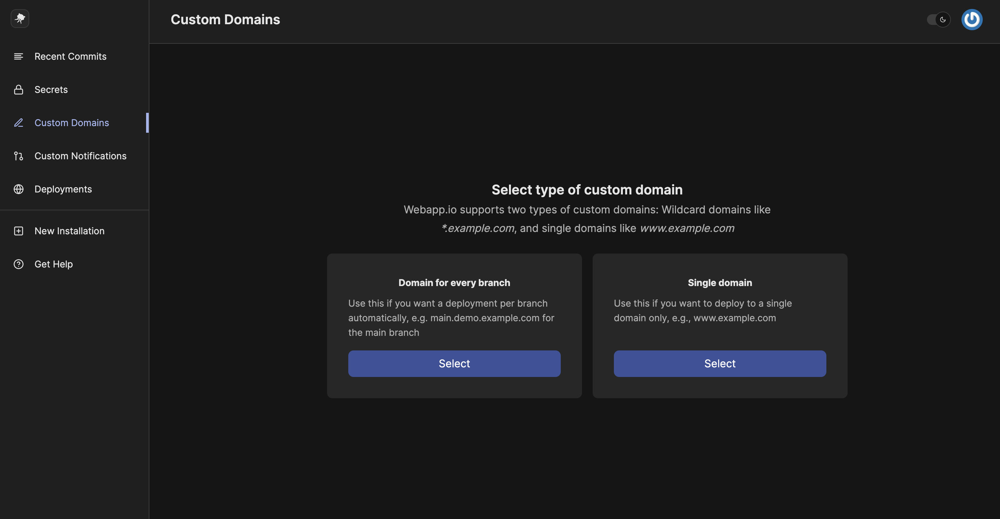
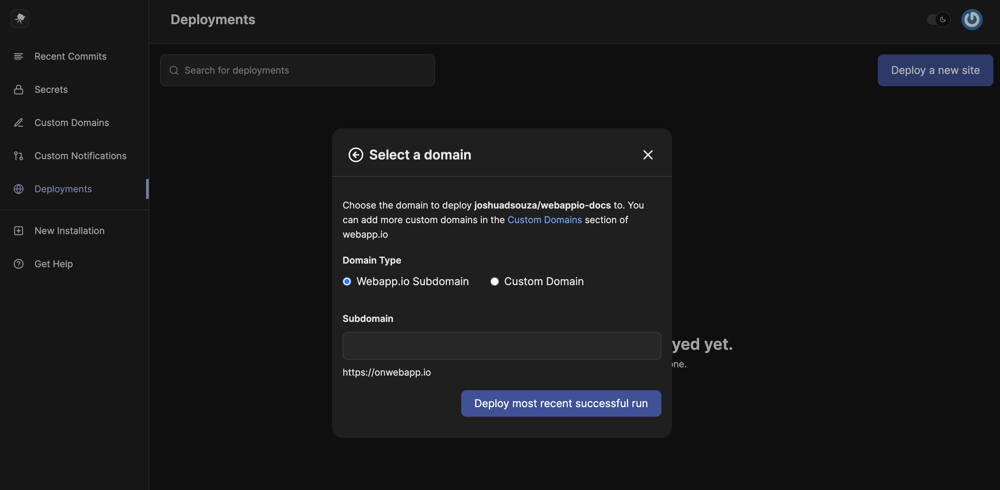

## Custom Domains

If you want to deploy your webapp.io virtual machine to a custom domain, add a domain in the `Custom Domains` section from your organization dashboard.

## onwebapp.io Domain

If you don't have a domain that you want to deploy to or you want to test with a domain, you can use the `onwebapp.io` domain. 

To use this domain, click on `Webapp.io Subdomain` when selecting for a `Domain Type`.

In the input field, enter in a subdomain. A subdomain can only contain lowercase letters, numbers, and dashes. 

If your subdomain is available, we'll start a new run and deploy your project to the URL listed below the input field. If it's not available you'll receive an error to use a different domain.

<Warning>
- Dashes for the onwebapp.io subdomain are not allowed at the beginning or end of the subdomain
- You cannot deploy to the onwebapp.io domain
</Warning>