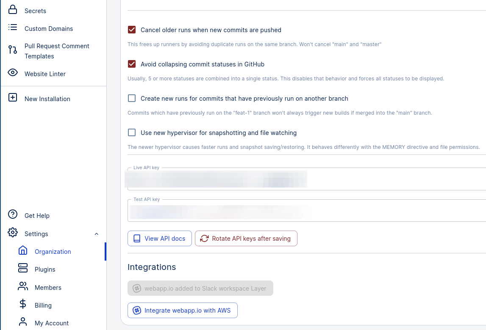
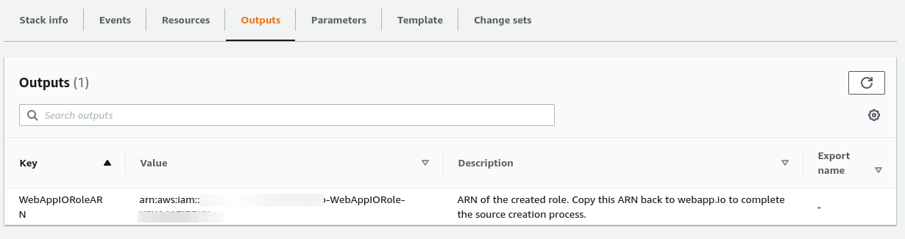
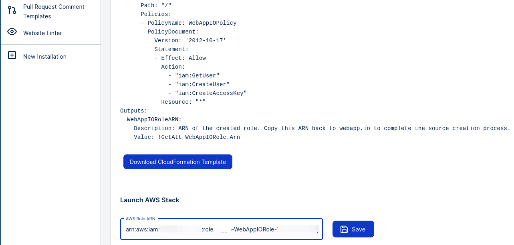

The `AWS` instruction provides multiple functionalities to ease your need to
connect with AWS.

## Examples usages:

### Making sure you are authenticated as the correct AWS user:

```docker Layerfile
#Use an Ubuntu 18.04 base image
FROM vm/ubuntu:18.04

# install AWS CLI
RUN apt-get update && apt-get install unzip
RUN curl "https://awscli.amazonaws.com/awscli-exe-linux-x86_64.zip" -o "awscliv2.zip"
RUN unzip awscliv2.zip
RUN ./aws/install
# set up
AWS link --region="us-east-1"
# Attach desired permissions to the user
RUN aws iam attach-user-policy --policy-arn arn:aws:iam:ACCOUNT-ID:aws:policy/AdministratorAccess --user-name Alice
# Check caller identity
RUN aws sts get-caller-identity
```

### Running a new EC2 instance and run an example Cal.com task with ECS:

```docker Layerfile
#Use an Ubuntu 18.04 base image
FROM vm/ubuntu:18.04

RUN curl "https://awscli.amazonaws.com/awscli-exe-linux-x86_64.zip" -o "awscliv2.zip"
RUN apt-get update && apt install unzip
RUN unzip awscliv2.zip
RUN ./aws/install
#The following line specifies an EC2 user data script that launches your container instance into a non-default 'calcom' cluster
#We save the script into my_script.txt for later use
RUN echo -e '#!/bin/bash\necho "ECS_CLUSTER=calcom" >> /etc/ecs/ecs.config' >> my_script.txt
AWS link --region='us-east-1'
#Run an ECS optimized AMI and save the instance identifier into instance_id.txt for later use
RUN aws ec2 run-instances --image-id ami-040d909ea4e56f8f3 --instance-type t2.micro --iam-instance-profile Name="ecsInstanceRole" \
--user-data file://my_script.txt --output text --query "Instances[*].InstanceId" > instance_id.txt
#Wait for the instance to come up...
RUN aws ec2 wait instance-status-ok --instance-ids $(cat instance_id.txt)
#Start the Cal.com pod with your own task configuration...
#Note that it is required to set output format to text otherwise it might cause the instruction to hang
RUN aws ecs run-task --cluster calcom --task-definition ECSCalComDemoTask:1 --output text
#Done! You can now access the Cal.com scheduler through the public IPv4 address of the EC2 instance
#If you cannot connect, make sure you set the correct security group/inbound rules
```

## Prerequisite

**Step 1:** Navigate to the Organization tab under Settings in your webapp.io
account.


Note: If you can't see this option, contact us and we will enable this feature
for your organization.

**Step 2:** Click ‘Integrate webapp.io with AWS’ at the bottom. Download the
CloudFormation template and then click `Launch Stack on AWS`.


**Step 3:** Upload the template and create a stack with it.


**Step 4:** After the stack is created, go to output tab and copy the value of
key `WebAppIORoleARN`.


**Step 5:** Paste the AWS role ARN back to webapp.io and click `Save`. All done!


## Available commands and syntax

### link

```bash
AWS link --region=aws_region_name
```

This command sets up environment variables of the vm for the AWS user we created for your organization and default region you specified.

You can attach relevant permissions to this user through AWS console/CLI. After attaching required permissions, you can use AWS CLI in a layerfile like you normally do.

### install

```bash
AWS install
```

This command installs AWS CLI in the vm. After running `AWS link ...` you will be able to run AWS CLI commands directly with `RUN aws ...`

### run-instances

```bash
AWS run-instances --cli-input-json=file_name
```

This command is a wrapper for `aws ec2 run-instances`. The difference being that we keep track of the EC2 instance that gets created and terminate it after the snapshot for the layerfile this command runs in gets deleted.

You must give permission to the user that we create for you with `AWS link` command through AWS console or AWS CLI.

You also need an input file in your current WORKDIR. You can use `aws ec2 run-instances --generate-cli-skeleton` to generate a template formatted in JSON and make changes to it accordingly.

### run-instances

```bash
AWS run-task --cli-input-json=file_name
```

This command is a wrapper for `aws ecs run-task`. The difference being that we keep track of the ECS tasks that is run and stop it after the snapshot for the layerfile this command runs in gets deleted.

You must give permission to the user that we create for you with `AWS link` command through AWS console or AWS CLI.

You also need an input file in your current WORKDIR. You can use `aws ecs run-task --generate-cli-skeleton` to generate a template formatted in JSON and make changes to it accordingly.
